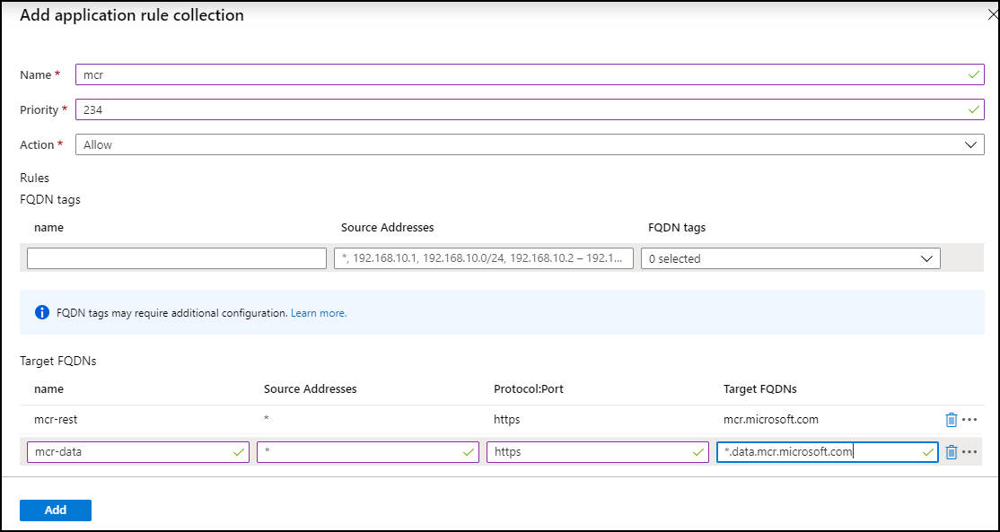

# Microsoft Container Registry (MCR) Client Firewall Rules Configuration

MCR is an implementation of the [OCI Distribution Specification][oci-spec] which delivers [artifacts][oci-artifacts], such as container images. The Distribution Spec defines two endpoints:

- **REST Endpoint**: providing content discovery. This is the url users are most familiar with with pulling an image: `docker pull mcr.microsoft.com/windows/servercore:1909`. The REST endpoint is load balanced across multiple worldwide regions, providing consistent content addressable artifacts.
- **Data Endpoint**: providing content delivery. As a registry client discovers the content required, it negotiates a set of content urls, pulling from the data endpoint. To provide reliable delivery of content, the data endpoint is backed by regionalized CDN endpoints.

## Table of Contents

- [Configuring Client Firewall Rules](#configuring-client-firewall-rules)
- [Data Endpoint Change](#data-endpoint-change)
- [Registry FQDN Endpoints](#registry-fqdn-endpoints)
- [Testing the `*.cdn.mscr.io` Data Endpoint](#testing-the-cdnmscrio-data-endpoint)
- [Testing the `*.data.mcr.microsoft.com` Data Endpoint](#testing-the-datamcrmicrosoftcom-data-endpoint)
- [Q&A](#qa)
- [Rollout Status](#rollout-status)

## Configuring Client Firewall Rules

> ### **DATA ENDPOINT CHANGE**
> **Note: to provide users enough time to adjust, we have extended the change date to June 15, 2020.**  
> To provide a consistent FQDN between the REST and data endpoints, beginning **June 15, 2020** the data endpoint will change from `*.cdn.mscr.io` to `*.data.mcr.microsoft.com`  
Deployments follow [Azure Safe Deployment Practices][azure-safe-deployment], which means changes will rollout, per region over several days. For this change, we will take a slower pace, rolling out a few regions and taking a pause of a few days to monitor feedback.  
Please monitor this page for [updates](#rollout-status), including the regional rollout dates and when the rollout is complete. 


## Registry FQDN Endpoints

To access MCR, the following FQDNs are required. 

| Purpose | Protocol | Target FQDN | Available |
| - | - | - | - |
| Registry Endpoint | https | `mcr.microsoft.com` | Now |
| Data Endpoint | https | `*.cdn.mscr.io` | Now |
| Data Endpoint | https | `*.data.mcr.microsoft.com` | Starting June  15, 2020 |

If you're updating this prior to June 15th, adding both data endpoints will assure a smooth transition. Once the consolidated data endpoint deployment is complete, we'll update this page enabling the removal of `*.cdn.mscr.io`.



## Testing the `*.cdn.mscr.io` Data Endpoint

To validate configurations pre June 15th, 2020, the following multi-arch images are available for testing. 

### Windows & Linux
To test pulling an image:  
`docker pull mcr.microsoft.com/mcr/hello-world`

Visualizing the data urls:  
`curl https://mcr.microsoft.com/v2/hello-world/blobs/sha256:fce289e99eb9bca977dae136fbe2a82b6b7d4c372474c9235adc1741675f587e`

produces a url with `[oldRegionReference].cdn.mscr.io` :
```
<a href="https://mcrwcus0.cdn.mscr.io/f439446e126348d29d8a8c39253da1ca-gqcvpppbjg//docker/registry/v2/blobs/...
```

## Testing the `*.data.mcr.microsoft.com` Data Endpoint

To validate changes will work post June 15, 2020, the following images are available for testing today.

**Note:** Separate repos for Windows and Linux are provided for verification:

### Windows

`docker pull mcr.microsoft.com/mcrlabscdnone/hello-world`

Visualizing the data urls:  
`curl  https://mcr.microsoft.com/v2/mcrlabscdnone/hello-world/blobs/sha256:fce289e99eb9bca977dae136fbe2a82b6b7d4c372474c9235adc1741675f587e`

produces a url with `[region].data.mcr.microsoft.com` :
```
<a href="https://westcentralus.data.mcr.microsoft.com/f439446e126348d29d8a8c39253da1ca-gqcvpppbjg//docker/registry/v2/blobs/...
```

### Linux

`docker pull mcr.microsoft.com/mcrlabscdnone/hello-world-linux`

Visualizing the data urls:  
`curl  https://mcr.microsoft.com/v2/mcrlabscdnone/hello-world-linux/blobs/sha256:fce289e99eb9bca977dae136fbe2a82b6b7d4c372474c9235adc1741675f587e`

produces a url with `[region].data.mcr.microsoft.com` :
```
<a href="https://westcentralus.data.mcr.microsoft.com/f439446e126348d29d8a8c39253da1ca-gqcvpppbjg//docker/registry/v2/blobs/...
```

### Q&A
- **Q: What do I do now, to prepare for this change?**  
  **A:** If you require client firewall rules, follow the above guidance, adding both data endpoints to your outbound firewall rules. If you do not use outbound firewall rules, no change is necessary.
- **Q: Are there any risks to adding both endpoints?**  
  **A:** Both data endpoints are owned and maintained by Microsoft. Both are secure. Adding both domains eases the transition.
- **Q: If both domains are secure, why are you making this change?**  
  **A:** We've received feedback that having multiple root domains is confusing as it's not obvious that registries require multiple endpoints. Putting both endpoints under `microsoft.com` provides more trust and confidence that these are operated by Microsoft.
- **Q: How can I test my firewall configurations before the change?"**  
  **A:** See [Testing the `*.data.mcr.microsoft.com` Data Endpoint](#testing-the-datamcrmicrosoftcom-data-endpoint) above.

## Rollout Status
### March 3rd, 2020 Update
Regional rollout changes began, switching from `*.cdn.mscr.io` to `*.data.mcr.microsoft.com`.

### March 9th, 2020 Update
During the multi-region deployment, we discovered AKS node scaling and service updates could fail. To minimize the impact, we are rolling back the data endpoint change which completed Friday, March 13, 2020.

### March 16th, 2020 Update

As of March 13, 2020, all regions have been rolled back with data endpoints being served from `*.cdn.mscr.io`

To minimize disruptions, allowing teams to focus on other matters, the MCR team has extended the change date to June 15, 2020.  
*See [Q&A](#qa) above*

More information on the [Microsoft Container Registry][mcr]

[azure-safe-deployment]: https://azure.microsoft.com/blog/advancing-safe-deployment-practices/
[mcr]:                   https://aka.ms/mcr
[oci-spec]:              https://github.com/opencontainers/distribution-spec
[oci-artifacts]:         https://github.com/opencontainers/artifacts
